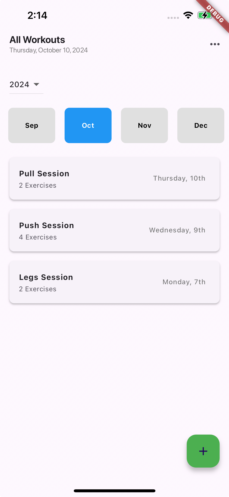
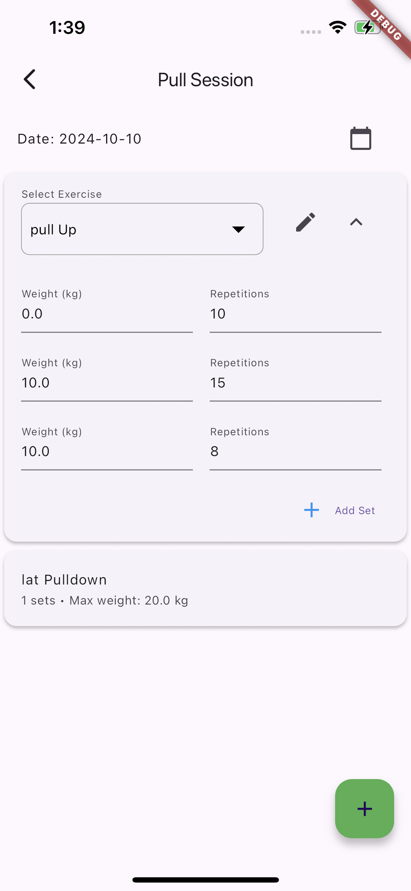

# Magic AI Workout App

Magic AI Workout App is an workout tracking app that keeps all your sessions in one place. It is a simple and easy to use app that helps you to track your workouts and progress.

<p align="center">
  
   
  
</p>

<!-- Architectural decisions
Packages explained -->

## Architecture
- Using GetX for state management
- Storing data in a Firebase Firestore database
- Using an MVC file structure, where a controller manages the state of the corresponding view

## Packages
- [GetX](https://pub.dev/packages/get): Chosen for its simplicity and efficiency in state management, GetX provides a reactive programming model that is easy to integrate and use, making it ideal for managing the app's state and dependencies. While for this app I could have just used [Provider](https://pub.dev/packages/provider) to manage the controllers, as I am not using GetX to handle the routing (only 2 pages). I chose to use GetX because of how simple and easy it is to use and the extra functionality it has as the app grows.
- [Firebase Core](https://pub.dev/packages/firebase_core): This package is essential for initializing Firebase in the app, providing the core functionalities needed to connect and interact with Firebase services.
- [Cloud Firestore](https://pub.dev/packages/cloud_firestore): Used for storing and syncing data in real-time, Cloud Firestore offers a scalable and flexible database solution that integrates seamlessly with Firebase, it is also very fast and easy to setup.
- [Intl](https://pub.dev/packages/intl): This package is used for internationalization and localization, allowing the app to format dates.

## Getting Started

Login and setup a new firebase project using the Firebase CLI
```bash
firebase login
flutterfire configure
```
Create a firebase Firestore database, and ensure you have a firebase_options.dart within /lib


## License

This project is licensed under the MIT License - see the [LICENSE](LICENSE) file for details.
